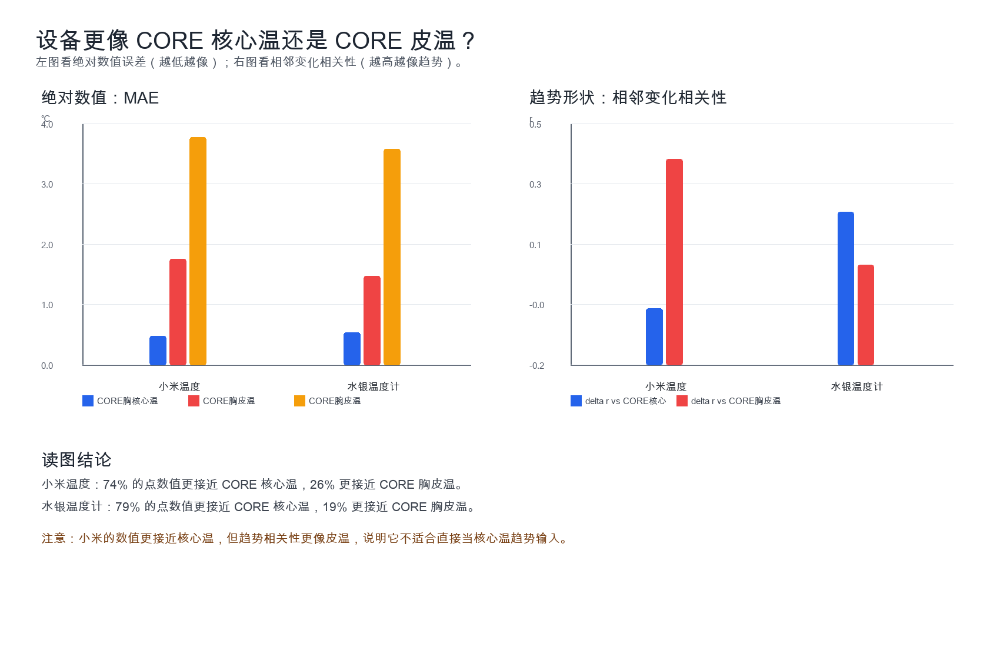
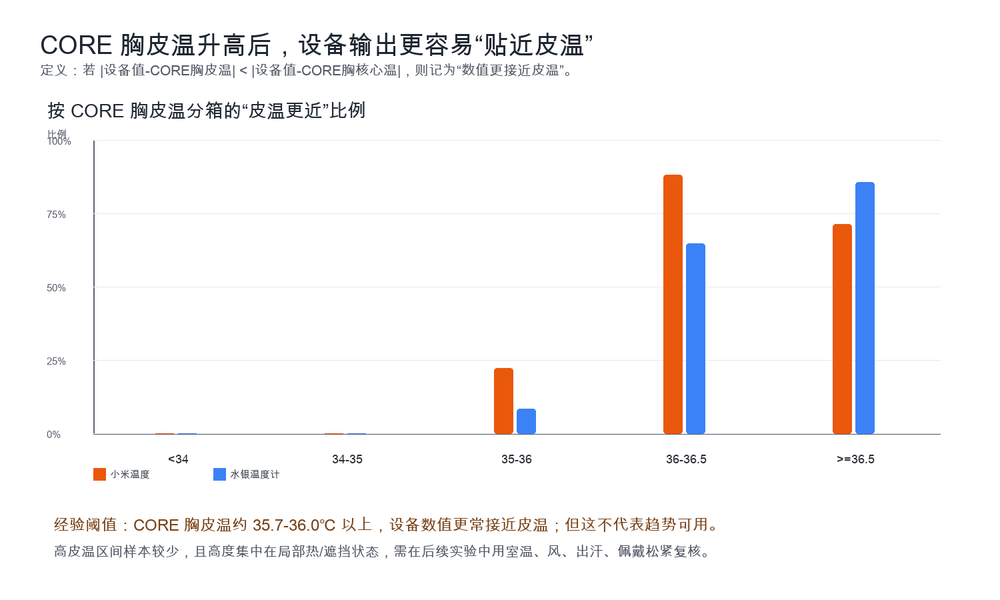
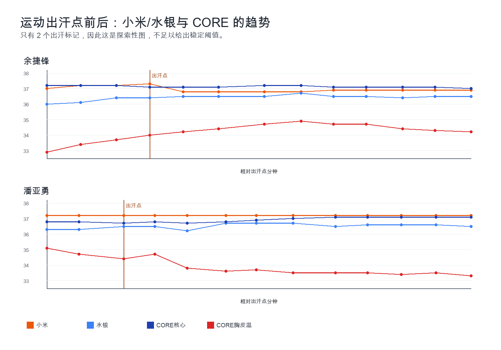

# 小米温度与 CORE/水银温度计对比完整报告

## 1. 结论先行

- 你原本的初步分析和按场景画图可以保留：逐点数值、场景内曲线和误差判断没有发现列错位或数值搬运错误。唯一需要修正的是 75 条场景123数据的日期占位问题，跨真实日期排序和相邻变化分析必须用 `Time_Corrected`。
- 小米相对 CORE 胸核心温的总体 MAE 为 0.47 ℃，RMSE 为 0.60 ℃，只有 45% 的点落在 ±0.3 ℃ 内；不适合作为经期、夜间恢复、昼夜节律的独立核心温输入。
- 水银温度计相对 CORE 胸核心温的 MAE 为 0.54 ℃，但 Pearson r=0.56，趋势/排序比小米更像 CORE 核心温；其绝对值存在系统性低估。
- “像核心温还是皮温”要分开看：小米数值上 74% 的点更接近 CORE 核心温，但相邻变化趋势与胸皮温的相关性更高（delta r=0.40，vs 核心温 -0.04）。
- 当 CORE 胸皮温升到约 35.7-36.0 ℃ 以上时，小米/水银的读数更常在绝对数值上靠近胸皮温而不是核心温；但这主要反映局部热环境/遮挡/皮温接近体温，不代表设备可稳定追踪皮温趋势。

## 2. 采集了哪些数据

- 数据时间范围：校正后点测时间覆盖 2026-03-26 至 2026-04-08。
- 受试者：4 人；其中李芷欣为女性，其余受试者为男性。
- 有效点测：107 条。原始 Excel 可解析 108 条，其中邱晓健 `重新佩戴` 1 条因小米和 CORE 核心温为空被剔除。
- 设备/变量：小米温度、水银温度计、CORE 胸核心温、CORE 胸皮温；其中 75 条场景123数据还包含 CORE 腕体温、CORE 腕皮温和心率；出汗标记只有 2 个。

| 受试者 | 点测数 | 日期范围 |
| --- | --- | --- |
| 余捷锋 | 13 | 2026-04-03 至 2026-04-03 |
| 李芷欣 | 40 | 2026-03-26 至 2026-04-08 |
| 潘亚勇 | 38 | 2026-04-02 至 2026-04-02 |
| 邱晓健 | 16 | 2026-03-31 至 2026-04-01 |

| 场景类别 | 点测数 |
| --- | --- |
| 24小时生活趋势 | 32 |
| 衣着/遮挡环境干扰 | 49 |
| 运动挑战 | 26 |

| 变量 | n | 最小值 | 最大值 | 均值 |
| --- | --- | --- | --- | --- |
| 小米温度 | 107 | 36.30 | 37.60 | 36.84 |
| 水银温度计 | 107 | 36.00 | 37.30 | 36.59 |
| CORE胸核心温 | 107 | 36.50 | 38.00 | 37.11 |
| CORE胸皮温 | 107 | 32.70 | 37.00 | 35.11 |
| CORE腕体温 | 75 | 36.80 | 38.00 | 37.14 |
| CORE腕皮温 | 75 | 31.60 | 34.70 | 33.03 |

## 3. 数据质量说明

- `combined_temperature_test_data.csv` 与原始 Excel 清洗结果逐行一致，数值列没有发现错位。
- 场景123登记表原始只记录时分秒，原整合脚本统一补成 `2026-03-31`。报告已用连续 CORE 文件推断真实会话日期，生成 `processed_temperature_data_with_corrected_dates.csv`。
- 原图如果是按单个主题/场景看时间序列，解读没有问题；如果把不同真实日期的场景串起来做相邻变化，则应以本报告的校正口径为准。

## 4. 总体准确性：相对 CORE 胸核心温

| 设备 | n | 平均偏差℃ | MAE℃ | RMSE℃ | Pearson r | ±0.3℃内 | ±0.5℃内 | ±1.0℃内 |
| --- | --- | --- | --- | --- | --- | --- | --- | --- |
| 小米温度 | 107 | -0.27 | 0.47 | 0.60 | -0.19 | 45% | 68% | 93% |
| 水银温度计 | 107 | -0.53 | 0.54 | 0.58 | 0.56 | 22% | 50% | 96% |
| CORE 腕部体温 | 75 | 0.06 | 0.33 | 0.43 | -0.05 | 64% | 80% | 100% |

解读：小米的平均偏差不算特别大，但离散度和趋势相关性差；水银温度计绝对值偏低更明显，但与 CORE 核心温的排序/相关性更好。

## 5. 小米趋势/变化量表现：换成直观说法

这里不看单个温度值，而看相邻两次测量之间“设备有没有跟着 CORE 核心温同向变化”。这更接近经期、恢复、昼夜节律模型需要的趋势能力。

| 场景 | 相邻变化数 | CORE有变化数 | CORE变化时同向率 | delta MAE vs CORE | 水银同向率 | 水银delta MAE |
| --- | --- | --- | --- | --- | --- | --- |
| 24小时生活趋势 | 30 | 24 | 21% | 0.31 | 29% | 0.24 |
| 衣着/遮挡环境干扰 | 45 | 23 | 22% | 0.06 | 43% | 0.11 |
| 运动挑战 | 24 | 11 | 0% | 0.08 | 27% | 0.13 |

- 24 小时生活趋势：CORE 核心温有可见变化时，小米只有约 21% 同向，delta MAE 约 0.31 ℃。
- 衣着/遮挡场景：小米的变化量绝对差较小，但这更多是因为两边变化幅度都小；CORE 真变化时同向率仍只有约 22%。
- 运动挑战：小米在潘亚勇运动段全程 37.2 ℃平台化，CORE 有变化时同向率为 0%，因此不能用“运动场景 MAE 小”来证明趋势可用。

## 6. 小米/水银更像核心温还是皮温？

| 设备 | n | 数值更接近CORE核心温 | 数值更接近CORE胸皮温 | 数值接近持平 |
| --- | --- | --- | --- | --- |
| 小米温度 | 107 | 74% | 26% | 0% |
| 水银温度计 | 107 | 79% | 19% | 2% |

| 设备 | 变化量n | delta r vs CORE核心 | delta r vs CORE胸皮温 | 变化量更接近核心 | 变化量更接近皮温 | CORE有变化时同向率 |
| --- | --- | --- | --- | --- | --- | --- |
| 水银温度计 | 99 | 0.24 | 0.09 | 57% | 25% | 34% |
| 小米温度 | 99 | -0.04 | 0.40 | 61% | 22% | 17% |

- 小米：数值层面更像核心温，但趋势层面更受皮温/局部环境影响。它与 CORE 胸皮温的 delta r=0.40，高于与核心温的 delta r=-0.04。
- 水银：数值也更接近核心温，且 level r=0.56 明显高于小米；趋势上也比小米更像核心温，但绝对值整体偏低。

## 7. 是否存在“某个温度点以上更像皮温”的阈值？

| 设备 | CORE胸皮温区间 | n | 更接近皮温比例 | MAE vs 核心温 | MAE vs 胸皮温 |
| --- | --- | --- | --- | --- | --- |
| 小米温度 | <34 | 20 | 0% | 0.27 | 3.48 |
| 小米温度 | 34-35 | 27 | 0% | 0.25 | 2.31 |
| 小米温度 | 35-36 | 36 | 22% | 0.49 | 1.32 |
| 小米温度 | 36-36.5 | 17 | 88% | 0.84 | 0.32 |
| 小米温度 | >=36.5 | 7 | 71% | 0.94 | 0.43 |
| 水银温度计 | <34 | 20 | 0% | 0.54 | 3.00 |
| 水银温度计 | 34-35 | 27 | 0% | 0.44 | 2.01 |
| 水银温度计 | 35-36 | 36 | 8% | 0.55 | 0.94 |
| 水银温度计 | 36-36.5 | 17 | 65% | 0.64 | 0.45 |
| 水银温度计 | >=36.5 | 7 | 86% | 0.60 | 0.26 |

- 用 CORE 胸皮温做分层时，阈值信号很明显：胸皮温低于 35 ℃ 时，小米和水银几乎从不更接近皮温；胸皮温 36-36.5 ℃ 时，小米 88% 的点、水银 65% 的点数值更接近皮温。
- 最优分割大致在胸皮温 35.7-36.0 ℃；但这个阈值是以 CORE 胸皮温为条件，不是小米自身读数阈值。用小米读数本身找不到稳定阈值。
- 这更像是“皮肤被衣物/局部热环境加热后接近体温，设备读数落在皮温和核心温之间”的现象，而不是小米真正切换成了皮温传感器。

## 8. 出汗点前后是否出现趋势差异？

| 设备 | 阶段 | n | MAE vs CORE核心 | 平均偏差 | 设备范围 | CORE核心范围 | CORE胸皮温均值 |
| --- | --- | --- | --- | --- | --- | --- | --- |
| 小米温度 | 出汗前 | 5 | 0.20 | 0.12 | 37.0-37.2 | 36.8-37.2 | 33.96 |
| 小米温度 | 出汗后 | 21 | 0.25 | 0.03 | 36.8-37.3 | 36.7-37.2 | 34.07 |
| 水银温度计 | 出汗前 | 5 | 0.82 | -0.82 | 36.0-36.4 | 36.8-37.2 | 33.96 |
| 水银温度计 | 出汗后 | 21 | 0.50 | -0.50 | 36.2-36.7 | 36.7-37.2 | 34.07 |

| 设备 | 阶段 | 变化量n | delta MAE vs CORE核心 | delta MAE vs 胸皮温 | 同向率 vs CORE核心 |
| --- | --- | --- | --- | --- | --- |
| 小米温度 | 出汗前 | 3 | 0.07 | 0.33 | 67% |
| 小米温度 | 出汗后 | 21 | 0.09 | 0.23 | 43% |
| 水银温度计 | 出汗前 | 3 | 0.13 | 0.27 | 33% |
| 水银温度计 | 出汗后 | 21 | 0.12 | 0.21 | 33% |

- 出汗标记只有 2 个，证据不足以建立通用出汗阈值。
- 运动出汗后，小米 MAE 从约 0.20 ℃ 到 0.25 ℃，没有出现绝对误差突然崩坏；但趋势上常平台化，尤其潘亚勇运动后小米全程 37.2 ℃。
- 因此当前更合理的产品规则不是“出汗后完全不可用”，而是“运动/出汗/快速状态切换时降低温度趋势权重，尤其不要用单点变化判断核心温趋势”。

## 9. 三类未来输入的可用性判断

| 未来输入 | 判断 | 理由 |
| --- | --- | --- |
| 女性经期/月周期高低温趋势 | 不建议独立使用 | 月周期信号常在 0.2-0.5 ℃量级；小米总体 MAE 0.47 ℃，女性受试者 MAE 0.80 ℃，且没有真实月周期重复数据。 |
| 夜间恢复/多日绝对值温差 | 当前不建议 | 跨日绝对值需要稳定偏差；小米一致性界限宽，24小时生活趋势下 delta MAE 0.31 ℃，且存在小米不变/突降与 CORE 不一致。 |
| 昼夜节律/日周期趋势 | 不建议作为主输入 | 昼夜节律需要连续趋势方向；24小时场景 CORE 变化时小米同向率约 21%，不足以做主信号。 |

## 10. 容易不准确的状态

- 个体差异/佩戴差异：李芷欣明显低估，潘亚勇部分场景接近或偏高。
- 衣着遮挡和局部热环境：衣着/遮挡场景 MAE 最高，高误差集中在李芷欣厚外套/遮挡。
- 胸皮温较高（约 35.7-36.0 ℃以上）：设备数值更容易靠近皮温，核心温解释风险上升。
- 运动、出汗、快速状态切换：绝对误差未必最大，但趋势平台化和方向不一致明显。
- 通勤/可能有风/暴露环境：原始数据没有风速字段，不能定量证明，但从通勤和裸露场景看应列为下一轮重点控制变量。

## 11. 下一步实验建议

- 每个受试者连续 14-28 天夜间固定窗口采样，才能验证经期、恢复、昼夜节律。
- 记录室温、湿度、风、衣着、佩戴松紧、摘戴/洗澡/运动/出汗时间点。
- 建模时先做个人基线校准；遇到运动、出汗、通勤、皮温高、快速变化时降低小米温度权重。
- 用趋势前先过滤异常：佩戴后稳定期、皮温骤变、心率/运动强度突变、环境变化。
